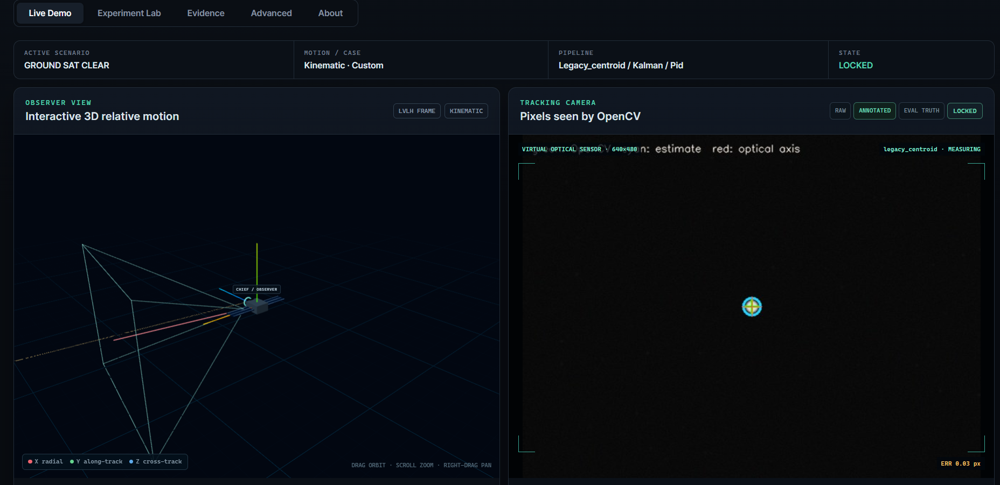
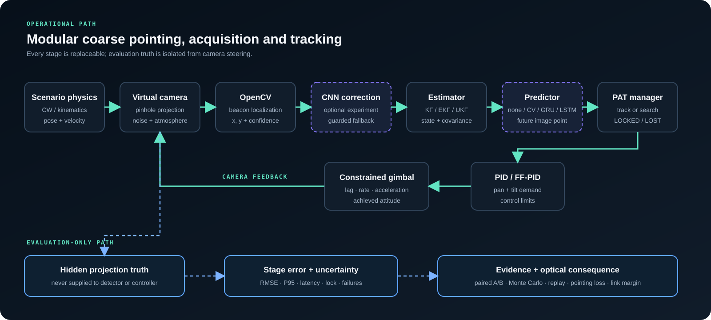
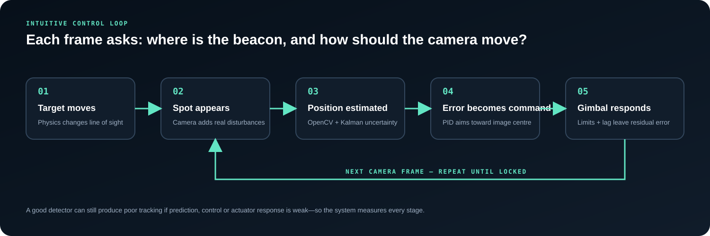
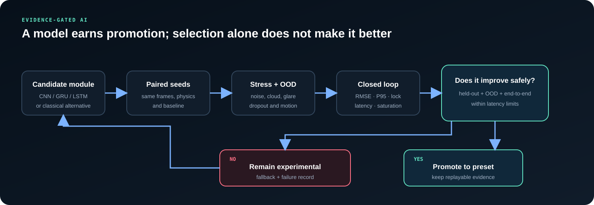
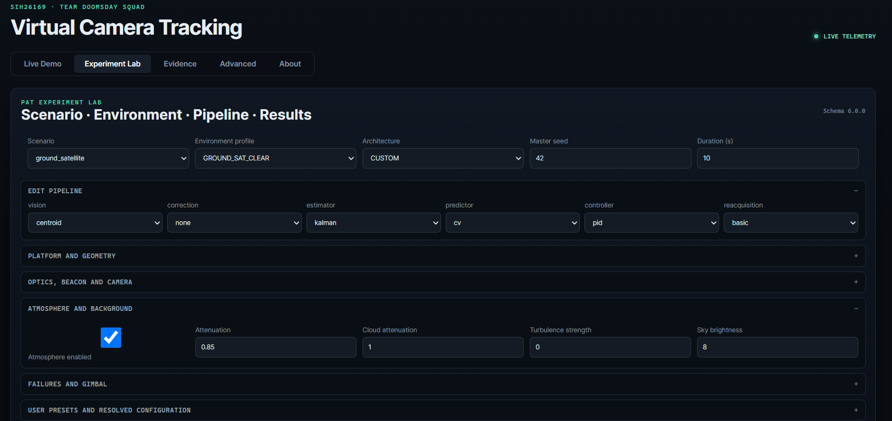
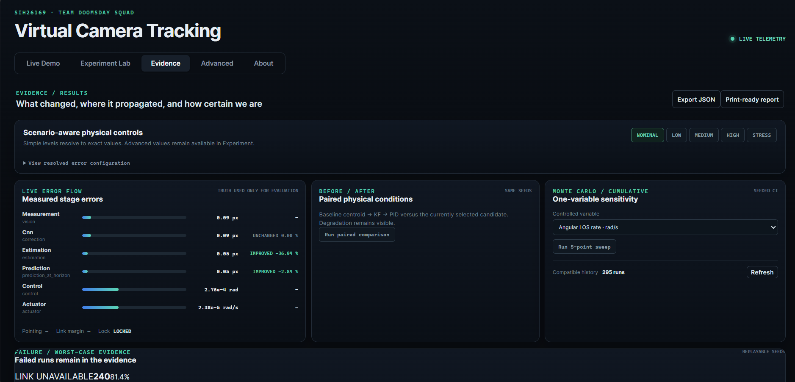
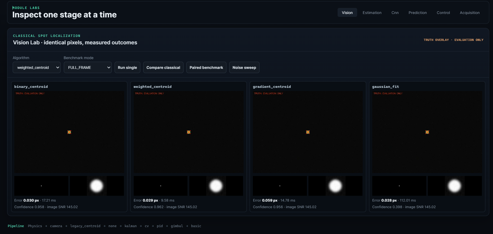
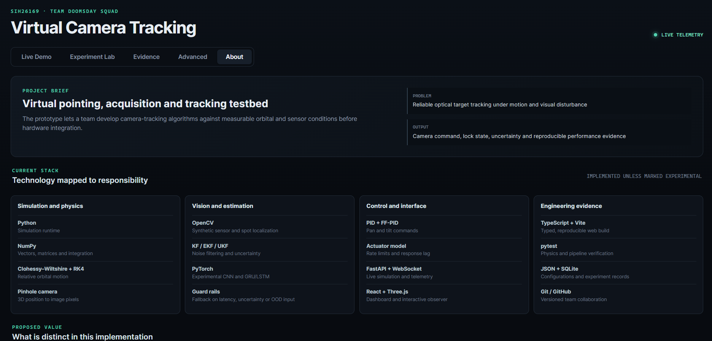

# SIH26169 — AI-Based Virtual Camera Tracking

**Team Doomsday Squad · Smart India Hackathon 2026 · ISRO**

[](https://www.python.org/)
[](https://fastapi.tiangolo.com/)
[](https://opencv.org/)
[](frontend/)
[](tests/)

> A software-in-the-loop laboratory for developing, comparing and validating coarse pointing, acquisition and tracking (PAT) algorithms for mobile Free Space Optical Communication terminals.



## 1. Project information

| Field | Value |
| --- | --- |
| Project | **SIH 26 — Virtual Camera Tracking** |
| PS ID | **SIH26169** |
| PS title | **Development of an AI-Based Virtual Camera Tracking System for Coarse Alignment of Mobile Free Space Optical Communication (FSOC) Terminals** |
| Organization | **Indian Space Research Organisation (ISRO)** |
| Category | **Software** |
| Theme | **Miscellaneous** |
| Team | **Doomsday Squad** |

## 2. Problem

Narrow FSOC beams need reliable pointing, acquisition and tracking. Before fine alignment can begin, a coarse camera loop must find the remote beacon, estimate its location and steer a pan–tilt terminal to keep it inside the field of view. Testing this directly with optical terminals and gimbals is expensive and difficult to repeat.

## 3. Proposed solution

This project closes that loop entirely in software. It generates reproducible target motion and disturbances, renders a virtual camera feed, localizes the beacon with OpenCV, estimates its motion, commands a constrained gimbal and records lock/error evidence. Classical and learned methods receive identical frames and seeds, so an experimental AI stage is promoted only when it improves held-out, out-of-distribution and closed-loop results.

## 4. Architecture



The stable demonstration path is:

`Physics → virtual camera → OpenCV centroid → Kalman filter → PID → constrained gimbal → camera feedback`

CNN correction and GRU/LSTM prediction are optional experiment stages. Ground truth follows an isolated evaluation path and never steers the operational loop.

[Read the architecture and interface notes](docs/architecture.md)

## 5. What makes this implementation distinct

- **End-to-end PAT loop:** motion, image formation, localization, estimation, prediction, control, actuator response and reacquisition are connected.
- **Scenario-correct physics:** analytical/RK4 Clohessy–Wiltshire motion is reserved for nearby satellite cases; kinematic models cover ground and UAV cases.
- **Failure-aware testing:** cloud loss, glare, background distractors, vibration, latency, dropout and gimbal limits remain visible in results.
- **Fair algorithm comparison:** paired methods receive the same pixels, configuration and deterministic seeds.
- **Evidence-gated AI:** selectable CNN and temporal models retain safe classical fallbacks and are not labelled better unless benchmarks support the claim.
- **Replayable evidence:** Monte Carlo records, worst-case seeds, configuration versions and JSON/CSV exports make results auditable.

## 6. Error and validation cycles





The dashboard distinguishes three commonly confused quantities:

| Metric | Meaning |
| --- | --- |
| CV accuracy | OpenCV measurement versus hidden projected truth; evaluation only |
| Estimator error | filtered image position versus hidden truth |
| Closed-loop tracking error | true projected target versus the camera centre after gimbal response |

## 7. Working features

- Interactive Three.js observer view and OpenCV camera view
- Configurable ground–satellite, satellite–satellite, UAV and disturbance scenarios
- Analytical and RK4 Clohessy–Wiltshire propagation with named relative-motion cases
- Binary, weighted and gradient centroids plus bounded Gaussian fitting
- KF, EKF, UKF and adaptive Kalman estimator laboratories
- PID and feed-forward PID control with rate, acceleration and position constraints
- PAT states: `SEARCH`, `ACQUIRE`, `TRACK`, `LOCKED`, `LOST`, `REACQUIRE`
- Raster/spiral/predicted search experiments
- Optional CNN correction and GRU/LSTM temporal prediction laboratories
- Scenario-aware error presets, paired A/B runs and seeded Monte Carlo sweeps
- Optical pointing-loss and received-power consequence model
- FastAPI/WebSocket live telemetry, JSON/SQLite experiment records and report export

## 8. Technology stack

| Layer | Technologies | Responsibility |
| --- | --- | --- |
| Simulation and physics | Python, NumPy, analytical CW, RK4, pinhole camera | target motion, coordinate transforms and image projection |
| Vision | OpenCV | beacon candidate extraction and sub-pixel localization |
| Estimation | KF, EKF, UKF, adaptive KF | noise filtering, uncertainty and motion state |
| AI experiments | PyTorch, CNN, GRU/LSTM | residual spot correction and future-position prediction |
| Control | PID, FF-PID, actuator model | pan/tilt commands, saturation and mechanical response |
| API | FastAPI, Pydantic, WebSocket | configuration, live frames, telemetry and experiment endpoints |
| Dashboard | React, TypeScript, Vite, Three.js | 3D observer, experiment controls and evidence views |
| Evidence | SQLite, JSON, CSV, pytest | repeatability, history, exports and verification |

## 9. Run the project

### Windows one-command launch

Requirements: Python 3.11+ and Node.js 20+.

```powershell
git clone https://github.com/AtulyaSRawat18/SIH26169-Virtual-Camera-Tracking-ISRO.git
cd SIH26169-Virtual-Camera-Tracking-ISRO
.\launch_simulation.cmd
```

Open `http://127.0.0.1:8000` if the browser does not open automatically. Stop with `Ctrl+C`.

### Manual launch

```powershell
python -m venv .venv
.\.venv\Scripts\python.exe -m pip install -r requirements.txt
cd frontend
npm install
npm run build
cd ..
.\.venv\Scripts\python.exe -m uvicorn backend.app:app --host 127.0.0.1 --port 8000
```

Optional learned-model tooling:

```powershell
.\.venv\Scripts\python.exe -m pip install -r requirements-ml.txt
.\.venv\Scripts\python.exe -m src.ml.cli --help
.\.venv\Scripts\python.exe -m src.prediction.cli --help
```

## 10. Verify

```powershell
.\.venv\Scripts\python.exe -m pytest -q
cd frontend
npm run build
```

## 11. Prototype screens

| Experiment configuration | Evidence and uncertainty |
| --- | --- |
| [](assets/screenshots/03-experiment-lab.png) | [](assets/screenshots/04-evidence-overview.png) |

| Classical vision comparison | Technology and implementation status |
| --- | --- |
| [](assets/screenshots/06-vision-lab.png) | [](assets/screenshots/07-about-stack.png) |

[Open the complete screenshot gallery with panel-by-panel briefs](assets/screenshots/README.md)

## 12. Repository structure

```text
SIH26169-Virtual-Camera-Tracking-ISRO/
├── README.md                  # reviewer entry point
├── SUBMISSION_GUIDE.md        # submission-readiness checklist
├── submission/                # presentation and demo-video references
├── assets/
│   ├── diagrams/              # architecture and evaluation graphics
│   └── screenshots/           # numbered prototype evidence
├── docs/                      # architecture, methods and demo guides
├── backend/                   # FastAPI/WebSocket application
├── frontend/                  # React/TypeScript/Three.js dashboard
├── src/                       # simulation, vision, estimation, AI and control
├── configs/                   # versioned scenarios and runtime configuration
├── models/                    # small model checkpoints and registry
├── evidence/                  # checked-in benchmark summaries
└── tests/                     # physics, pipeline and API verification
```

## 13. Team responsibility map

| Member | Primary responsibility | Required hand-off |
| --- | --- | --- |
| 1 | Architecture, interfaces and integration | contracts, versions and integrated release |
| 2 | Physics and target/camera geometry | trajectories, coordinate conventions and truth data |
| 3 | Rendering, disturbances and OpenCV | camera frames, degradations and measurements |
| 4 | Kalman tracking, PID and metrics | state estimates, gimbal commands and PAT metrics |
| 5 | FastAPI, React dashboard and streaming | live API, UI and experiment controls |
| 6 | AI, dataset, comparison and evidence | trained candidates, paired benchmarks and promotion decision |

## 14. Submission and documentation

- [Submission checklist](SUBMISSION_GUIDE.md)
- [Presentation status](submission/PRESENTATION.md)
- [Demo-video plan](submission/DEMO.md)
- [Final system overview](docs/FINAL_SYSTEM_OVERVIEW.md)
- [Judge demo guide](docs/SIH_DEMO_GUIDE.md)
- [Experiment guide](docs/EXPERIMENT_GUIDE.md)
- [Technology stack](docs/technology-stack.md)

## Current maturity and limits

The physics, virtual camera, OpenCV localizers, estimators, classical controllers, gimbal model, PAT state machine, dashboard and evidence framework are implemented. CNN correction, learned temporal prediction and MPC remain experimental. Flight hardware, calibrated optics, qualified atmospheric models, fine steering, BER receiver modelling and reinforcement learning are not claimed as implemented.

This is an algorithm-development simulator; it does not certify flight hardware. Hardware-in-the-loop testing and real sensor/actuator calibration remain future validation steps.

## License

Released under the [MIT License](LICENSE).
