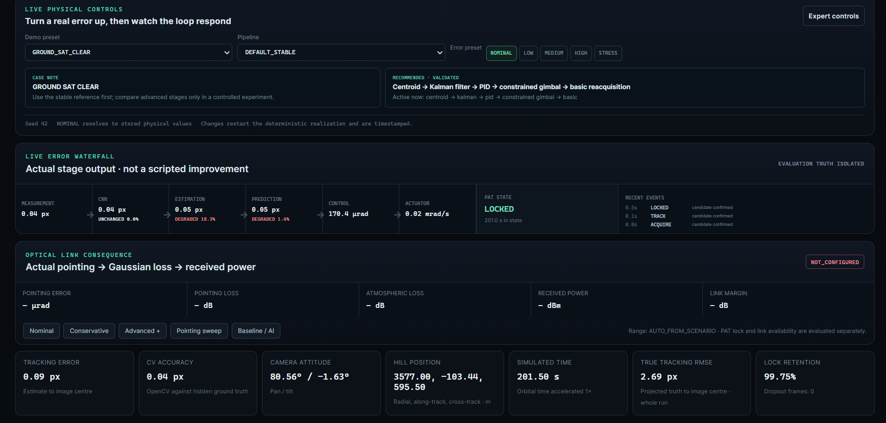
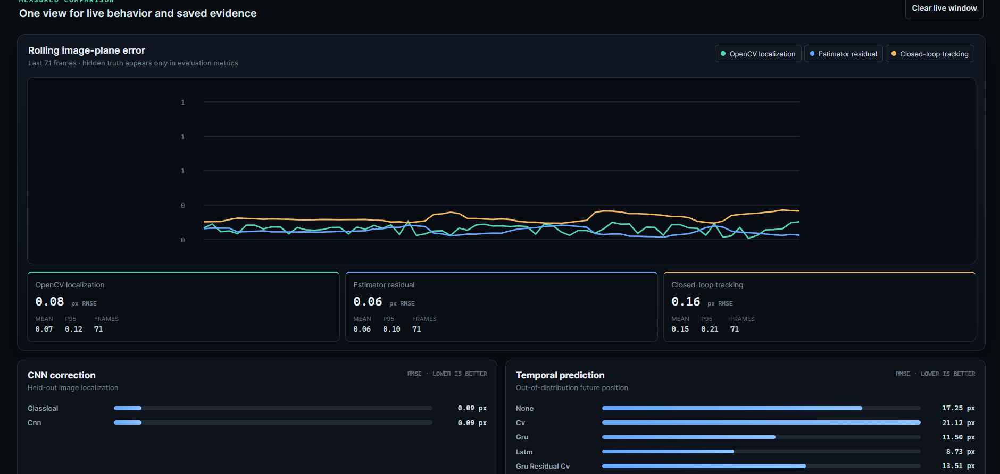
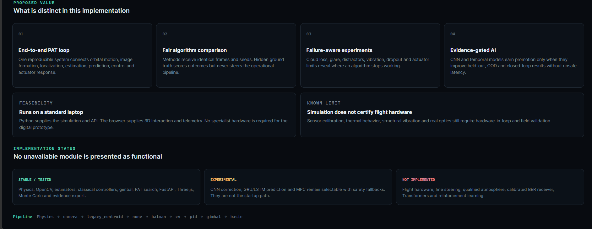

# Project Screenshots

These screenshots are selected prototype evidence for SIH26169. They show the actual application, configuration workflow, measured outputs and implementation boundaries—not design mock-ups.

## 01 — Live 3D observer and tracking camera

The left panel is an orbitable Three.js observer view of the target, camera body, field-of-view cone and trajectory. The right panel is the virtual optical sensor processed by OpenCV. The cyan marker is the measured beacon, the crosshair represents the optical axis and the state banner shows whether PAT is locked.

## 02 — Physical controls, error propagation and PAT state

The selected scenario, architecture and error level resolve to versioned physical values. The waterfall exposes the actual output after measurement, optional CNN correction, estimation, prediction, control and actuator response. It can show degradation; it is not scripted to make later stages appear better. PAT transitions and lock retention are displayed beside the live errors.

## 03 — Experiment Lab

This page constructs reproducible experiments. A reviewer can select the physical scenario, environment profile, architecture, master seed and duration, then edit the vision, correction, estimator, predictor, controller and reacquisition stages. Expandable sections expose geometry, optics, atmosphere, failure and gimbal variables.

## 04 — Evidence overview

The Evidence page turns a live demonstration into an auditable experiment. It provides scenario-aware error levels, a stage-error flow, paired baseline/candidate testing, seeded one-variable sensitivity sweeps and replayable worst-case seeds. Hidden truth is restricted to evaluation.

## 05 — Rolling performance and AI evidence

The rolling graph separates OpenCV localization, estimator error and closed-loop pointing performance. RMSE, mean and P95 prevent a single attractive frame from representing the entire run. CNN and temporal-prediction cards show held-out/OOD results; lower error is better, and experimental models are not promoted merely because they are selectable.

## 06 — Classical Vision Lab

Binary centroid, weighted centroid, gradient centroid and bounded Gaussian fitting receive identical pixels. Each card exposes error, latency, confidence and image SNR. This makes the speed–accuracy trade-off visible and keeps the evaluation truth separate from the operational detector.

## 07 — Technology mapped to responsibility

The About page maps technologies to their engineering jobs: Python/NumPy/CW for physics, OpenCV and Kalman variants for perception, PID plus an actuator model for camera steering, and FastAPI/React/Three.js for live operation and evidence presentation.

## 08 — USP, feasibility and implementation status

The final overview separates stable/tested, experimental and not-implemented capabilities. The core USP is a reproducible end-to-end PAT loop with fair algorithm comparison, failure-aware experiments and evidence-gated AI. The page also states the main limitation: simulation supports algorithm development but does not certify flight hardware.

## Naming and privacy

Files use the numbered naming scheme recommended by the NSUT SIH submission template. Screenshots contain no passwords, API keys, access tokens or private credentials.
